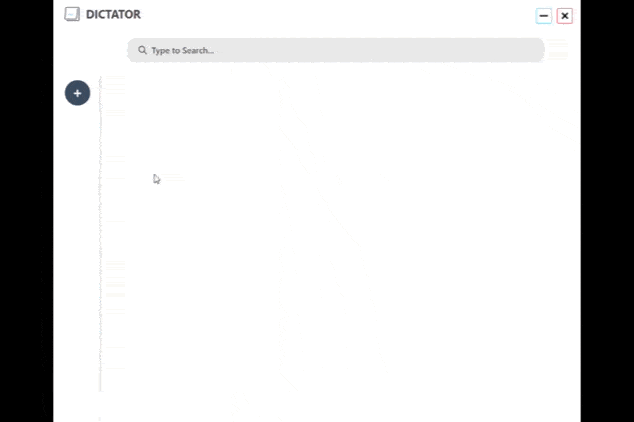

# dictator

A voice note app that listens to your mic or speaker and takes down everything it hears...

<<<<<<< HEAD

=======

>>>>>>> 7fd008b86841db9336ed18bf61c938335bd0b66f

## Integrating Electron with React

This article helped me a lot. I hope this helps you too -
[Desktop App with React](https://www.section.io/engineering-education/desktop-application-with-react/)

## To Do

- Add Mic and Speaker Support
- Add Speech Recognition
- A More Responsive UI
- Implement Cloud Storage for Notes (Firebase or MongoDB)

## Commands

### npm start

Executes the react app in your browser

### npm run dev

Executes React app on localhost and renders the page in Electron App
